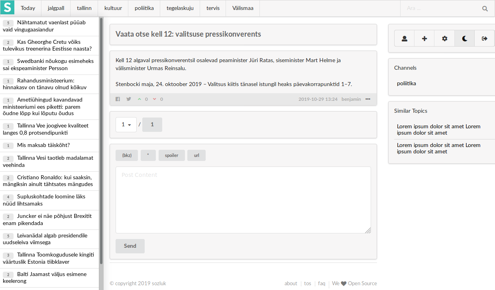

# SOCIOZAT

Sociozat is a Personalised Content Driven Community Platform

It aims to produce quality content on web with its precious `authors`. Users can filter the content based on their interests, set he bookmark urls to reach channels easily, create a topics, post a definition for a topic, subscribe to channels, users and topics.  

you can see the current `master` branch on live at [beta.sociozat.co](https://beta.sociozat.co)
also you can check our [docs](https://sociozat.org) and help us to improve. 

## Prerequisites

Sociozat is open-source project that everybody can contribute, create bug reports and feature requests.
Our main development platform is Github and we are using [issue tracker](https://github.com/sociozat/sociozat/issues).

## Installing

Continue reading [development docs](https://sociozat.org/docs/developer/installation)

## Contributing

Continue reading [contributing](CONTRIBUTING.md).

## License

Copyright 2019 Sociozat

Licensed under the Apache License, Version 2.0 (the "License");
you may not use this file except in compliance with the License.
You may obtain a copy of the License at

    http://www.apache.org/licenses/LICENSE-2.0

Unless required by applicable law or agreed to in writing, software
distributed under the License is distributed on an "AS IS" BASIS,
WITHOUT WARRANTIES OR CONDITIONS OF ANY KIND, either express or implied.
See the License for the specific language governing permissions and
limitations under the License.