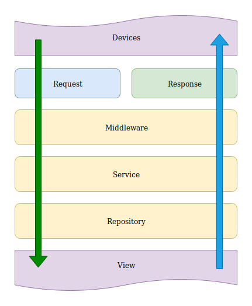

# Installation


### Using Docker Compose
``` 
git clone https://github.com/bencagri/sozluk
cd sozluk
docker-compose -p sozluk-app up
```
point your browser to `0.0.0.0:9000`

#### For Manual Installation

this project uses revel. so you also need to install [revel cmd](https://github.com/revel/cmd)


you need go v1.11+
also `dep` package manager

```
git clone https://github.com/bencagri/sozluk
cd sozluk
cp conf/app.conf.dist conf/app.conf
dep ensure
revel run
```
then point your browser to 127.0.0.1:9000


#### To build
```
revel build -a sozluk/ -t sozluk-app/ -m prod
```

Go will build the app inside sozluk-app. you can run `run.sh` to start web server


## Folder Structure Design


    conf/             Configuration directory
        app.conf      Main app configuration file
        routes        Routes definition file

    app/              App sources
        controllers/  App controllers go here
        models/       Models directory
        services/     Services directory
        repositories/ Repositories directory
        init.go       Interceptor registration
        views/        Templates directory

    messages/         Message files for internalization

    public/           Public static assets
        css/          CSS files
        js/           Javascript files
        images/       Image files

    tests/            Test suites


## Application Design

<div align="center">



</div>

We love *DRY* and *KISS*. So that, we are trying to follow principles in this app.

#### Middleware
In Middlewares we are using controllers which should receive request and send a response. thats it. they can use `services` and `helpers` but definetely **NOT** `repositories`

For example, web controllers can set cookie and render html `views`. On the other hand, api controllers can return json/xml response in order.

#### Services
Service layer is where the data manipulations, model validations, calculations (... etc) are made. Their `func`s may receive any type of data and they can return multiple types including `errors`

Services are used by controllers, and they can use repositories,models, any other helpers. 

#### Models
Data models that will be used both in services and repositories. 

#### Repositories
Persistence layer of the application. Repositories are responsible for CRUD operations on database using `models`


## Help
* [Github Issues](/issues)
* [Revel guides](http://revel.github.io/manual/index.html)

* [Gorm Manual](http://gorm.io/docs/index.html)

* [Effective Go](https://golang.org/doc/effective_go.html)
